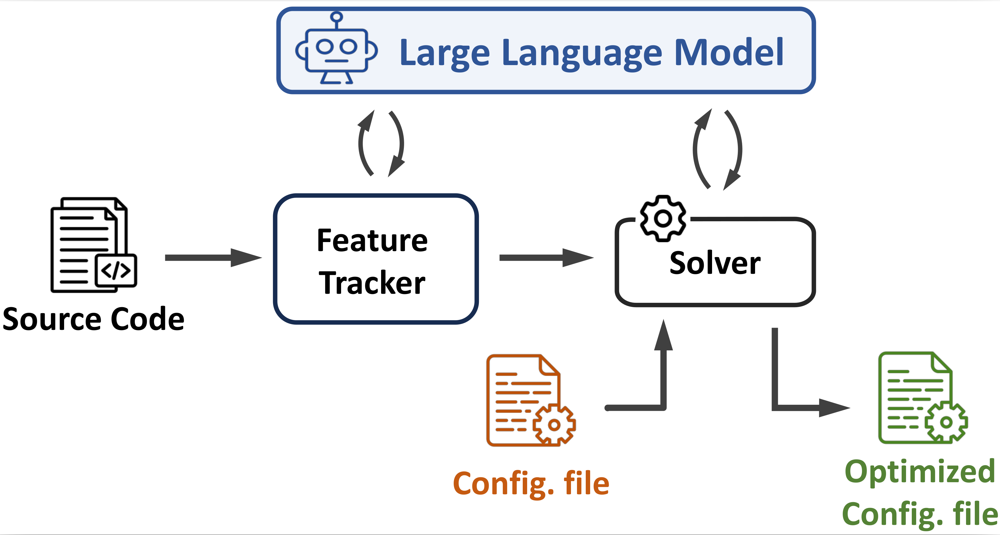

# FlowMage

FlowMage is a system that leverages Large Language Models (LLMs) to perform code analysis and extract essential information from stateful network functions (NFs) prior to their deployment on a server. It is designed to find the optimum RSS configuration to deploy a chain of stateful network functions on a commodity server. 

<p align="center">
<br>

<br>
</p>

FlowMage is framework agnostic by design, however it requires customized functions to (1) find related codes for a network function in a given framework, (2) parse input configuration files, and (3) apply the suggested configurations by writing back the output file with a correct syntax.

For more information check out our [paper][paper] at [EuroMLSys '24][EuroMLSys].

The current version of FlowMage is customized for [Fastclick][Fastclick].

## Repository Organization

This repository contains information, experiment setups, and some of the results presented in our EuroMLSys'24 paper. More specifically:
- `graphs` contains all raw experiment results, and gnuplot scripts to create graphs that are used in the evaluation section of the paper. The results are mainly derived from feeding [Fastclick][Fastclick] elements and [VPP][VPP] plugins as NF samples. Note that raw results are generated by [NPF][NPF] which we used to automate our experiments. We do not add NPF scripts to this repository to reduce the complexities for running Flowmage.
- `FlowMage` contains all source code and requirements for analyzing a Framework. The current version of system is customized for [Fastclick][Fastclick] as mentioned earlier; hence, you will find list of FastClick elements and extracted results for them in this repository. 

## Testbed

**NOTE: Before running the experiments, you need to prepare your testbed according to the following guidelines.**

The current version of FlowMage contains three separate modules for (1) extracting all related codes to a provided network function from the Framework (i.e., FastClick in the current version) (2) utilizing LLMs to find NFs attributes and (3) receiving a click configuration file, use the extracted attributes, and finally returning back a file containing optimized click configuration.

Flowmage utilizes LangChain to support state-of-the-art generative AI models. Please install all the requirements from ``requirements.txt`` before running FlowMage.

### Extracting NFs' Source Code
FlowMage receives the list of existing stateful NFs (or plugins in [VPP][VPP] language) and extracts the related source code for each NF to be processed. To do so, update the ``nfs_whitelist`` file with desired elements and run ``nfs_extractor.py`` with proper input. 

Required input variables are:

``--project_path`` : Path to the framework directory (i.e., FastClick).

``--results_path`` : Path to the desired output directory.

``--modules_name`` : List of NFs to process. If it is not provided, FlowMage uses the list in ``nfs_whitelist`` as mentioned earlier. 

### Extracting NFs' Features

Use ``llm-analysis.py`` to extract NF's attirbutes. The script provides a json containing extracted features for all NFs. It also keeps the result for each run separated which allows us further analysis on the accuracy of various models. Possible input variables are: 

``--model``: LLM model to utilize. possible options are _gpt-3.5-turbo_, _gpt-4-turbo_, _codellama-7b-instruct_, _codellama-13b-instruct_, _codellama-34b-instruct_, and _gemini-1-pro_. Default is _gpt-4-turbo_

``--iterations``: Number of runs for each NF. Default is 5.

``--source_path``: Directory path to the extracted NFs source code. it should be the same as ``--results-path`` in the previous step in a normal condition.

``--results_path``: Path to the desired output directory where the json file will be written.

### Running Solver

The solver receives a configuration file as input and provides an optimized version of that without affecting semantics. To do so, you can use ``solver.py`` with the following input parameters:

``--llm_analysis_path``: Direction to the output json file from the previous step. 
``--input``: input configuraiton file. 
``--output``: expected output file.

## Citing our paper
If you use FlowMage, please cite our paper:

```bibtex
@inproceedings{FlowMage,
author = {Ghasemirahni, Hamid and Farshin, Alireza and Scazzariello, Mariano and Chiesa, Marco and Kosti{\'c}, Dejan},
title = {Deploying Stateful Network Functions Efficiently
using Large Language Models},
year = {2024},
isbn = {79-8-4007-0541-0/24/04},
publisher = {Association for Computing Machinery},
address = {New York, NY, USA},
url = {https://doi.org/10.1145/3642970.3655836},
doi = {10.1145/3642970.3655836},
booktitle = {Proceedings of the 4th Workshop on Machine Learning and Systems},
numpages = {11},
keywords = {Intra-Server Load Balancing, Stateful Network
Functions, LLMs, Static Code Analysis, RSS Configuration},
location = {Athens, Greece},
series = {EuroMLSys '24}
}
```

## Help
If you have any question regarding the code or the paper you can contact me (hamidgr [at] k t h [dot] s e).

[NPF]: https://github.com/tbarbette/npf
[FastClick]: https://github.com/tbarbette/fastclick
[VPP]: https://fd.io/
[paper]: https://doi.org/10.1145/3642970.3655836
[EuroMLSys]: https://euromlsys.eu/#about